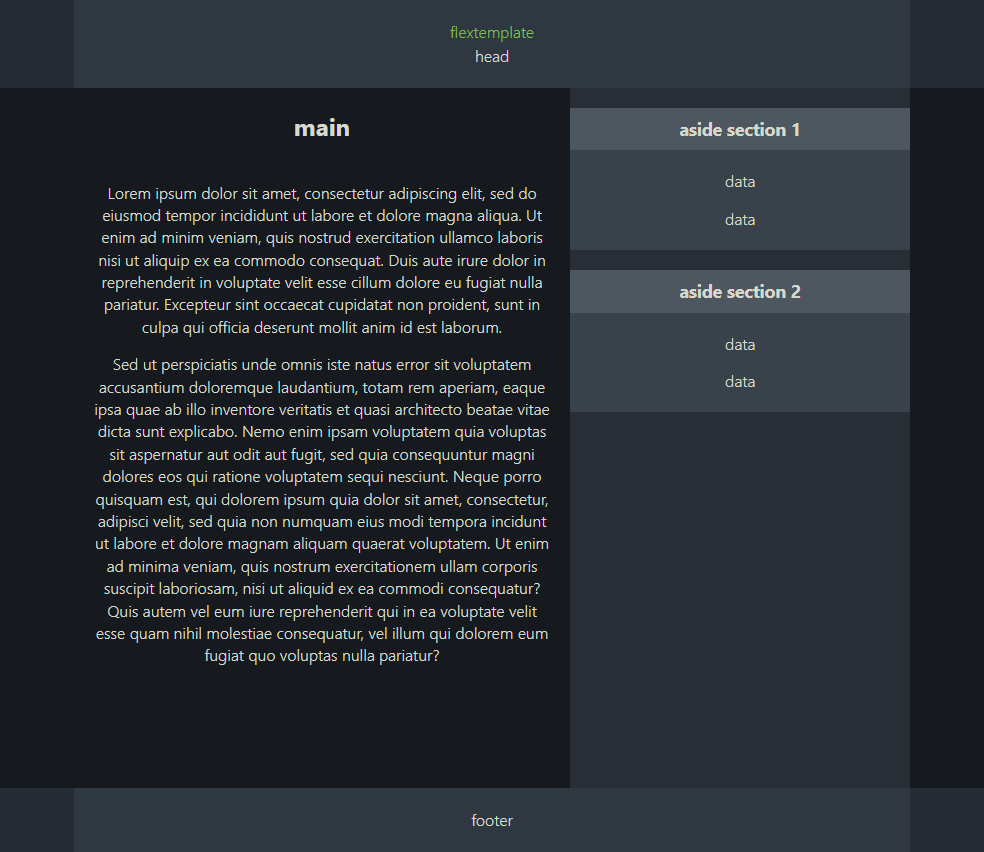

# Flex template

A flexible HTML template with a main area and aside, where the aside width is always fixed and only the main area and margins grow depending on screen size.

Here's a screenshot:

## Main features

- Mobile first CSS
- Highly adaptable to all screen sizes
- Pleasant bleed and margin spacing
- Footer is always at the bottom of the page
- Everything is simple and customizable
- No JavaScript dependencies.

This template was written years ago and I use a similar version on my own website.

Free to use.

### There are no plans to actively update this template, but I may improve it if I determine its beneficial.